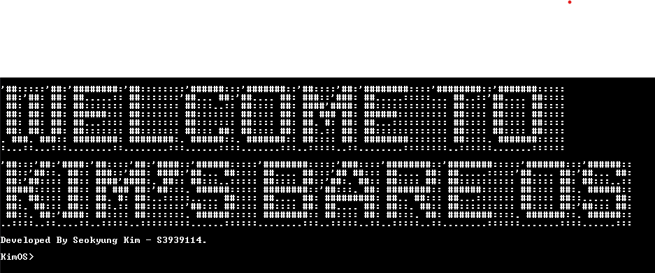
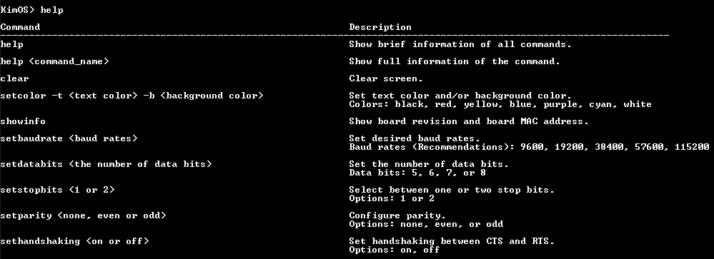
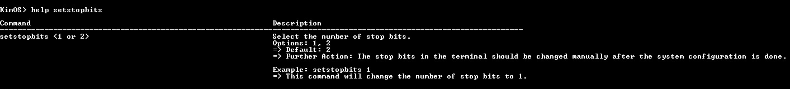
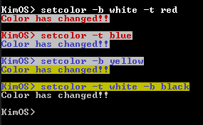

# EEET2490 Embedded Systems Operating System & Interfacing A2

This repository contains the individual assessment 2 for the course EEET2490 Embedded Systems: Operating Systems & Interfacing.

## Learning Objectives Assessed

- Practical Programming skills for embedded systems using C/C++
- Toolchains and project management
- Components and Development Process of an operating system
- Knowledge of Common Sensors

## Build Bare Metal OS

- Displaying Welcome Message and OS Name Prompt
- Auto-completion with TAB key: Implement logic to suggest completions based on partially entered commands.
- Command history navigation: Allow users to navigate through previously entered commands using \_ and + keys.
- Deletion in commands while typing in console: Users can now delete characters in their command input by using the backspace or delete keys.
- Implement specific commands as described.

### Available Commands and Descriptions

- **`help`**: Show brief information of all commands.

- **`help <command_name>`**: Show full information of a specific command.

- **`clear`**: Clear screen.

- **`setcolor -t <text color> -b <background color>`**: Set text color and/or background color. Available colors: black, red, yellow, blue, purple, cyan, white.

    

- **`showinfo`**: Show board revision and board MAC address.

- **`setbaudrate <baud rates>`**: Set desired baud rates. Baud rates would include 9600, 19200, 38400, 57600, 115200.

- **`setdatabits <the number of data bits>`**: Set the number of data bits. Data bits: 5, 6, 7, or 8.

- **`setstopbits <1 or 2>`**: Select between one or two stop bits. Options: 1 or 2.

- **`setparity <none, even or odd>`**: Configure parity. Options: none, even, or odd.

- **`sethandshaking <on or off>`**: Set handshaking between CTS and RTS.
